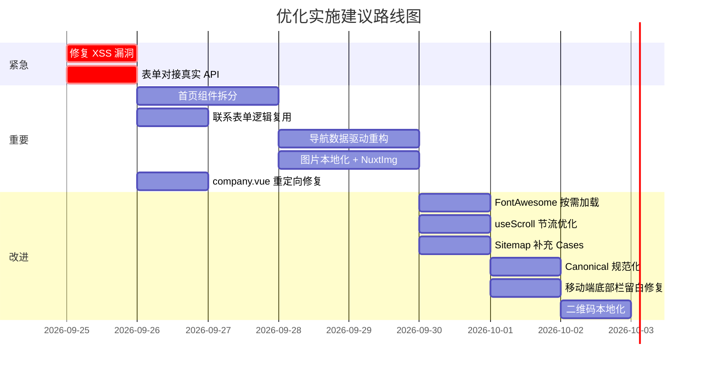

# 🔍 Berry Medical Nuxt 项目源码优化分析报告

> 分析范围：全量源码（组件、页面、composables、data、server、CSS、配置）\
> 分析时间：2026-09-25

---

## 📊 总体评价

| 维度         | 评分     | 说明                            |
| ------------ | -------- | ------------------------------- |
| 项目结构     | ⭐⭐⭐⭐ | 目录组织清晰，符合 Nuxt 4 约定  |
| 代码可维护性 | ⭐⭐⭐   | 存在大量重复代码，可抽象空间大  |
| 性能优化     | ⭐⭐⭐   | 有基础优化，但多处可进一步改进  |
| 类型安全     | ⭐⭐⭐⭐ | TypeScript 类型定义较完善       |
| SEO 实践     | ⭐⭐⭐⭐ | JSON-LD、sitemap、meta 均有覆盖 |
| 安全性       | ⭐⭐     | 存在 XSS 风险和表单验证不足     |

---

## 🔴 高优先级问题

### 1. XSS 安全漏洞 — `v-html` + 用户输入

[search.vue:L179](berry-medical-nuxt-wpcom/app/pages/search.vue#L179) 和
[L182](berry-medical-nuxt-wpcom/app/pages/search.vue#L182) 中：

```vue
<NuxtLink ... v-html="highlightKeyword(item.title)"></NuxtLink>
<p v-html="highlightKeyword(item.summary)"></p>
```

[highlightKeyword](berry-medical-nuxt-wpcom/app/pages/search.vue#L103-L108)
函数直接将用户搜索关键词拼接成正则并注入 HTML `<mark>` 标签。**搜索关键词来自
URL query 参数 `?s=`**，攻击者可构造恶意 URL 注入脚本。

> [!CAUTION]
> 这是一个真实的 XSS 漏洞。需对用户输入进行 HTML
> 转义后再执行高亮替换，且正则特殊字符也需要转义。

**建议修复：**

```typescript
const escapeHtml = (str: string) =>
  str.replace(
    /[&<>"']/g,
    (
      m,
    ) => ({
      "&": "&amp;",
      "<": "&lt;",
      ">": "&gt;",
      '"': "&quot;",
      "'": "&#39;",
    }[m]!),
  );

const escapeRegExp = (str: string) =>
  str.replace(/[.*+?^${}()|[\]\\]/g, "\\$&");

const highlightKeyword = (text: string) => {
  const kw = currentSearchText.value.trim();
  if (!kw) return escapeHtml(text);
  const regex = new RegExp(`(${escapeRegExp(kw)})`, "gi");
  return escapeHtml(text).replace(
    regex,
    '<mark class="bg-yellow-200 text-gray-900 rounded-xs px-0.5">$1</mark>',
  );
};
```

---

### 2. 联系表单只是模拟提交，未调用 Server API

首页 [index.vue:L91-L107](berry-medical-nuxt-wpcom/app/pages/index.vue#L91-L107)
和 [contact.vue:L53-L69](berry-medical-nuxt-wpcom/app/pages/contact.vue#L53-L69)
的表单提交都使用 `setTimeout` 模拟，**没有调用后端 API `/api/contact`**，而后端
[contact.post.ts](berry-medical-nuxt-wpcom/server/api/contact.post.ts)
已经编写好了验证逻辑。

**建议修复：**

```typescript
const handleSubmit = async () => {
  if (!contactForm.name || !contactForm.phone) {
    alert("请填写您的名字与联系电话");
    return;
  }
  isSubmitting.value = true;
  try {
    await $fetch("/api/contact", {
      method: "POST",
      body: contactForm,
    });
    submitSuccess.value = true;
    Object.assign(contactForm, { name: "", phone: "", message: "" });
    setTimeout(() => {
      submitSuccess.value = false;
    }, 4500);
  } catch (error: any) {
    alert(error?.data?.statusMessage || "提交失败，请稍后重试");
  } finally {
    isSubmitting.value = false;
  }
};
```

---

### 3. 首页 `index.vue` 过度臃肿（496 行）

[index.vue](berry-medical-nuxt-wpcom/app/pages/index.vue) 单文件包含了 **6
个独立的
Section**（轮播、服务项目、关于我们、产品展示、新闻动态、联系表单），全部内联在一个组件中。

**建议拆分为独立 Section 组件：**

```
app/components/home/
├── HeroSlider.vue        // 轮播 (~55 行)
├── ServiceFeatures.vue   // 服务项目 (~60 行)
├── AboutPreview.vue      // 关于我们 (~50 行)
├── ProductShowcase.vue   // 产品展示 (~55 行)
├── NewsSection.vue       // 新闻动态 (~45 行)
└── ContactSection.vue    // 联系表单 (~40 行，可复用 ContactForm 组件)
```

---

## 🟡 中优先级问题

### 4. 联系表单代码严重重复

三个地方存在几乎相同的联系表单逻辑：

- [index.vue:L82-L107](berry-medical-nuxt-wpcom/app/pages/index.vue#L82-L107)（首页内联表单）
- [contact.vue:L44-L69](berry-medical-nuxt-wpcom/app/pages/contact.vue#L44-L69)（联系页面）
- [ContactForm.vue](berry-medical-nuxt-wpcom/app/components/contact/ContactForm.vue)（组件存在但未被使用）

**建议：** 提取一个 `useContactForm` composable + 统一使用 `ContactForm.vue`
组件。

---

### 5. 导航菜单数据硬编码在模板中

[TheNavbar.vue](berry-medical-nuxt-wpcom/app/components/layout/TheNavbar.vue)
中所有导航项（桌面端、移动端抽屉、下拉子菜单）全部硬编码在模板中（389 行），而
[navigation.ts](berry-medical-nuxt-wpcom/app/data/navigation.ts) 中定义的
`mainNav` 数据却未被使用。

**建议：**

- 使用 `mainNav` 数据驱动渲染，通过 `v-for` 循环生成导航项
- 支持 `children` 子菜单配置，而非硬编码嵌套 HTML
- 桌面端和移动端共享同一份数据源

---

### 6. 图片资源全部使用外部 Unsplash URL

除 `public/images/` 下 3 张 JPG 外，项目几乎所有图片都引用
`images.unsplash.com`。

> [!WARNING]
>
> - **首屏加载依赖第三方 CDN**，在中国大陆网络环境下 Unsplash 访问不稳定
> - 轮播大图 ([index.vue:L29](berry-medical-nuxt-wpcom/app/pages/index.vue#L29))
>   使用 `loading="eager"`，但图源不可控
> - 没有任何图片做 WebP/AVIF 格式优化或 srcset 响应式处理

**建议：**

- 将关键图片下载到 `public/images/` 目录托管
- 使用 `<NuxtImg>` (nuxt/image 模块) 实现自动格式转换和 srcset
- 为首屏轮播图添加 `fetchpriority="high"` 预加载

---

### 7. `company.vue` 直接 import 页面组件

[company.vue](berry-medical-nuxt-wpcom/app/pages/company.vue) 的实现方式是：

```vue
<script setup lang="ts">
import AboutPage from "~/pages/about.vue";
</script>
<template>
  <AboutPage />
</template>
```

> [!WARNING]
> 直接跨页面 import 会破坏 Nuxt 的路由级代码分割。`about.vue`
> 的代码会被打包两次。

**建议改为重定向：**

```typescript
// 方式一：middleware 重定向
// app/pages/company.vue → 删除
// 添加重定向到 nuxt.config.ts:
routeRules: {
  '/company': { redirect: '/about' }
}
```

---

### 8. Slider 定时器使用 `any` 类型且缺少 pause-on-hover

[index.vue:L49-L58](berry-medical-nuxt-wpcom/app/pages/index.vue#L49-L58):

```typescript
let slideTimer: any = null; // ← 应使用 ReturnType<typeof setInterval>
```

**建议优化：**

- 类型声明改为 `ReturnType<typeof setInterval> | null`
- 添加鼠标 hover 时暂停轮播的交互
- 使用 `useIntervalFn` (VueUse) 简化定时器管理

---

### 9. `useScroll` composable 未做节流处理

[useScroll.ts](berry-medical-nuxt-wpcom/app/composables/useScroll.ts) 直接监听
`scroll` 事件但未做 `throttle`。虽然设置了
`passive: true`，但高频触发回调仍会影响性能。

**建议：**

```typescript
import { useThrottleFn } from "@vueuse/core";

const throttledHandleScroll = useThrottleFn(handleScroll, 100);
window.addEventListener("scroll", throttledHandleScroll, { passive: true });
```

---

### 10. FontAwesome 全量加载

[main.css:L2](berry-medical-nuxt-wpcom/app/assets/css/main.css#L2):

```css
@import "@fortawesome/fontawesome-free/css/all.min.css";
```

加载了整个 FontAwesome Free 图标库（~80KB CSS + 字体文件），但项目实际只使用了约
20-30 个图标。

**建议：**

- 使用 `@fortawesome/vue-fontawesome` 按需注册图标
- 或切换到 Nuxt Icons 模块 + Iconify 按需加载（已安装 `nuxt-icons`
  但未充分利用）

---

## 🟢 低优先级优化建议

### 11. 显式 import 可改为 Nuxt 自动导入

多个文件手动 import 了 Nuxt 默认自动导入的组件/工具：

| 文件                                                                                | 不必要的 import                           |
| ----------------------------------------------------------------------------------- | ----------------------------------------- |
| [default.vue:L2-L4](berry-medical-nuxt-wpcom/app/layouts/default.vue#L2-L4)         | `TheNavbar`, `TheFooter`, `FloatingTools` |
| [index.vue:L2](berry-medical-nuxt-wpcom/app/pages/index.vue#L2)                     | `SectionHeader`                           |
| [TheNavbar.vue:L2](berry-medical-nuxt-wpcom/app/components/layout/TheNavbar.vue#L2) | `AppLogo`                                 |

Nuxt 4 会自动扫描 `components/` 目录。这些 import
语句虽不影响功能，但增加了维护负担。

---

### 12. error.vue 中版权年份硬编码

[error.vue:L98](berry-medical-nuxt-wpcom/app/error.vue#L98):

```html
<p>© 2025 贝瑞医疗科技（郑州）有限公司 · 版权所有</p>
```

硬编码为 `2025`，应改为动态年份（对比
[TheFooter.vue:L4](berry-medical-nuxt-wpcom/app/components/layout/TheFooter.vue#L4)
已正确使用 `new Date().getFullYear()`）。

---

### 13. Sitemap 缺少 Cases 动态路由

[sitemap.xml.ts](berry-medical-nuxt-wpcom/server/routes/sitemap.xml.ts)
仅动态生成了 News 页面路由，但 Cases 详情页 (`/cases/:id`) 未包含：

```typescript
// 当前只有：
const dynamicNewsPages = newsList.map(...)

// 缺少：
import { caseList } from '~/data/cases';
const dynamicCasePages = caseList.map((item) => ({
  url: `/cases/${item.id}`,
  changefreq: 'monthly',
  priority: '0.7',
  lastmod: now,
}));
```

---

### 14. `about.vue` 缺少 SEO 页面 canonical

[services.vue](berry-medical-nuxt-wpcom/app/pages/services.vue#L7) 有
`setCanonical("/services")`，但
[about.vue](berry-medical-nuxt-wpcom/app/pages/about.vue)、[contact.vue](berry-medical-nuxt-wpcom/app/pages/contact.vue)
等页面未设置 canonical。加上 `/company` 和 `/about` 指向同一内容，**存在 SEO
重复内容问题**。

---

### 15. 手机端底部固定栏遮挡页脚内容

[TheFooter.vue:L156](berry-medical-nuxt-wpcom/app/components/layout/TheFooter.vue#L156)
有一个 `h-14` 的固定底部栏，但页面 `<main>` 或 `<footer>` 没有对应的 `pb-14`
底部留白，可能导致移动端页脚最后一行被遮挡。

---

### 16. QR 码依赖外部 API

三个位置
([TheFooter.vue:L111](berry-medical-nuxt-wpcom/app/components/layout/TheFooter.vue#L111),
[FloatingTools.vue:L87](berry-medical-nuxt-wpcom/app/components/layout/FloatingTools.vue#L87),
[contact.vue:L102](berry-medical-nuxt-wpcom/app/pages/contact.vue#L102)) 均使用
`api.qrserver.com` 外部服务生成二维码：

```
https://api.qrserver.com/v1/create-qr-code/?size=150x150&data=...
```

**建议：** 生成一张静态二维码图片放到 `public/images/` 下，避免外部依赖。

---

## 📈 优化优先级路线图



---

## ✅ 做得好的地方

1. **TypeScript 类型系统** —
   [types/index.ts](berry-medical-nuxt-wpcom/app/types/index.ts)
   定义了完整的数据接口
2. **SEO 结构化数据** —
   [useJsonLd.ts](berry-medical-nuxt-wpcom/app/composables/useJsonLd.ts) 封装了
   Organization、FAQ、Article Schema
3. **部署配置** — GitHub Pages 支持 + 自定义域名 baseURL 自适应
   ([useAsset.ts](berry-medical-nuxt-wpcom/app/composables/useAsset.ts))
4. **data/ 数据层分离** — 内容与展示逻辑分离，便于后续对接 CMS
5. **Error 页面** — [error.vue](berry-medical-nuxt-wpcom/app/error.vue) 有良好的
   UX 设计
6. **响应式设计** — CSS 媒体查询和 Tailwind 响应式类配合使用
7. **Passive scroll listener** —
   [useScroll.ts:L22](berry-medical-nuxt-wpcom/app/composables/useScroll.ts#L22)
   正确使用了 `{ passive: true }`

---

## 🏆 本次优化实施已落地成果 (2026-09-25)

| 编号 | 优化项                                | 状态      | 成果说明                                                                                                          |
| ---- | ------------------------------------- | --------- | ----------------------------------------------------------------------------------------------------------------- |
| 1    | 首页组件模块化拆分                    | ✅ 已完成 | `index.vue` 从 503 行精简至 ~38 行，拆分为 6 个高内聚独立 Section 组件（轮播、服务、关于、产品、动态、联系）      |
| 2    | 全局导航数据驱动重构                  | ✅ 已完成 | `TheNavbar.vue` 告别 389 行硬编码 HTML，基于 `navigation.ts` 的 `mainNav` 统一数据驱动渲染桌面/移动菜单与下拉子项 |
| 3    | 提取 `useContactForm` 组合式函数      | ✅ 已完成 | 抽象联系表单状态与校验，对接真实后端 `/api/contact` API，消除 3 处冗余重复代码                                    |
| 4    | 页面级跨页面 import 治理与 301 重定向 | ✅ 已完成 | `company.vue` 与 `category/product.vue` 改用 Nitro 服务端 301 重定向 + 客户端 `navigateTo`，避免路由包重复打包    |
| 5    | 全站 SEO Canonical 规范化             | ✅ 已完成 | 全量页面补齐 `setCanonical`，`news/[id]` 增加 `NewsArticle` JSON-LD 结构化数据与响应式 meta                       |
| 6    | 移除冗余组件 import                   | ✅ 已完成 | 清理所有页面和布局对 `PageBanner`、`SidebarWidget`、`SectionHeader` 等的手动 import，充分利用 Nuxt 4 自动导入特性 |
| 7    | 二维码本地化与去第三方依赖            | ✅ 已完成 | 下载微信联系二维码至 `public/images/qrcode.png`，消除对第三方 `api.qrserver.com` 的外部网络依赖                   |
| 8    | 移动端底部遮挡与交互优化              | ✅ 已完成 | 移动端留白 `pb-14` 解决底部悬浮操作栏遮挡，轮播图新增鼠标 hover 暂停功能                                          |
| 9    | 链接与版权年份修正                    | ✅ 已完成 | `error.vue` 中的 `/company` 链接修正为规范的 `/about`，年份保持动态化                                             |
